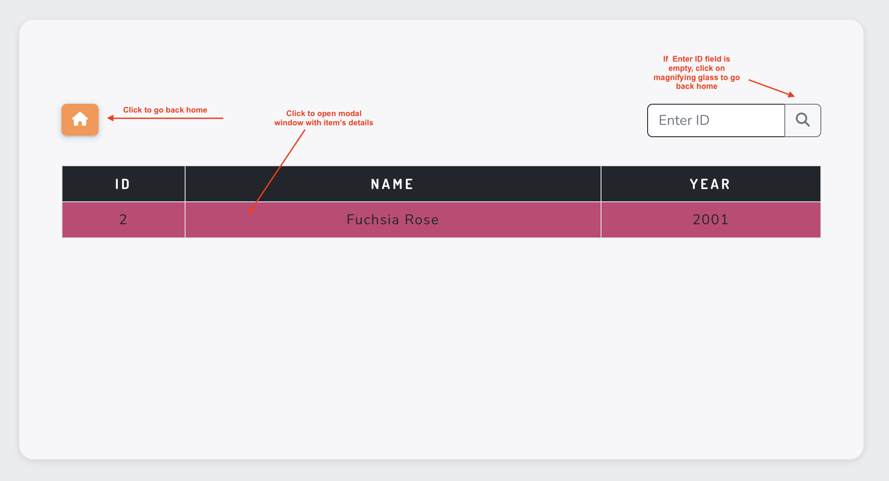

# 
 Codibly App 
<!-- omit in toc -->

##  <!-- omit in toc -->

## **Table of Contents**

- [**Table of Contents**](#table-of-contents)
- [**Overview**](#overview)
  - [Development](#development)
  - [Production](#production)
- [**Technologies Used**](#technologies-used)
- [**How to use?**](#how-to-use)
  - [Home Page Actions](#home-page-actions)
  - [ID Page Actions](#id-page-actions)
  - [Modal Actions](#modal-actions)
  - [URL functionality](#url-functionality)
- [**Credits**](#credits)
- [**Acknowledgments**](#acknowledgments)

## **Overview**

This project serves as a **Frontend Developer - Intern** recruitment task for [Codibly](https://codibly.com/). It is a simple web application for displaying items fetched from API Server in tabular format. The table is paginated to display five items. Users can click on a row to display the item's details in a modal.

The app is fully responsive and was tested on different screen sizes.

### Development

To run the development server:

1. Clone the repository to a local directory.
2. Change the directory to 'codibly-app' `cd codibly-app`.
3. For **NPM Package Manager**
   1. In the terminal type `npm install`
   2. Once the installation of dependencies is completed, type `npm run dev`.
4. For **Yarn Package Manager**:
   1. In the terminal type `yarn install`.
   2. Once the installation of dependencies is completed, type `yarn dev`
5. The development server should start, click on the link in the terminal for **localhost**.

### Production

The production version can be found [here](https://main--benevolent-toffee-0f7aae.netlify.app/).

API endpoint can be found [here](https://reqres.in/api/products/).

[Back to contents](#table-of-contents)

## **Technologies Used**

- ### Languages

  - [TypeScript](https://www.typescriptlang.org/): strongly typed programming language build on JavaScript used to develop interactive components of the website.
  - [HTML](https://developer.mozilla.org/en-US/docs/Web/HTML): the markup language used to create the website.
  - [CSS](https://developer.mozilla.org/en-US/docs/Web/css): the styling language used to style the website (used in styled-components)

- ### Frameworks and Libraries

  - [ReactJS](https://reactjs.org/): version 18.2.0, was used for building a user interface
  - [React Bootstrap](https://react-bootstrap-v4.netlify.app/): version 2.7.0, was used to style the app with built-in tools.
  - [styled-components](https://styled-components.com/): version 5.3.6, was used to inject CSS styling directly to component.
  - [React-Redux](https://react-redux.js.org/): version 8.0.5, state management tool used to create store for the app.
  - [Redux-Toolkit](https://redux-toolkit.js.org/): version 8.0.5, toolset for efficient Redux development.
  - [React Router](https://reactrouter.com/en/main): version 6.6.1, a library for client side routing.
  - [formik](https://formik.org/): version 2.2.9, a small library used for efficient form development.

- ### Other tools

  - [Netlify](https://www.netlify.com/): was used to build and host the front-end.
  - [Git](https://git-scm.com/): the version control system used to manage the code.
  - [Vite](https://vitejs.dev/): was used as a frontend development building tool.
  - [GitHub](https://github.com/): used to host the website's source code.
  - [VSCode](https://code.visualstudio.com/): the IDE used to develop the website.
  - [Fontawesome](https://fontawesome.com/): was used to implement icons with animation.
  - [Grammarly](https://www.grammarly.com/): was used to check grammar and typo errors.
  - [Yarn](https://yarnpkg.com/): package manager used for the project.
  - [eslint](https://eslint.org/): ESLint statically analyzes code to quickly find problems. Was used to check any linting errors and warning in the code.

[Back to contents](#table-of-contents)

## **How to use?**

Open the app by navigating to **[this](https://main--benevolent-toffee-0f7aae.netlify.app/)** page.

### Home Page Actions

### ID Page Actions

### Modal Actions

### URL functionality

Users can change the display by typing valid URL parameters. If they are invalid, users will be redirected to the "Not Found" page.

## **Credits**

1. Not working icon comes from "https://www.pngitem.com/middle/hJwTimh_thumb-image-dead-face-transparent-hd-png-download/".
2. 404 not found icon comes from "https://icon-library.com/".
3. Broken glass background comes from "https://www.cleanpng.com/png-transparent-glass-fragments-16845/download-png.html".

[Back to contents](#table-of-contents)

## **Acknowledgments**

1. **[Codibly](https://codibly.com/>) Recruitment Team** - for giving me a chance to improve my skills by doing this task - regardless of the outcome it was a great experience for self-development. Thank you!

[Back to contents](#table-of-contents)

---
**
Created by Milosz Misiek
**

    

